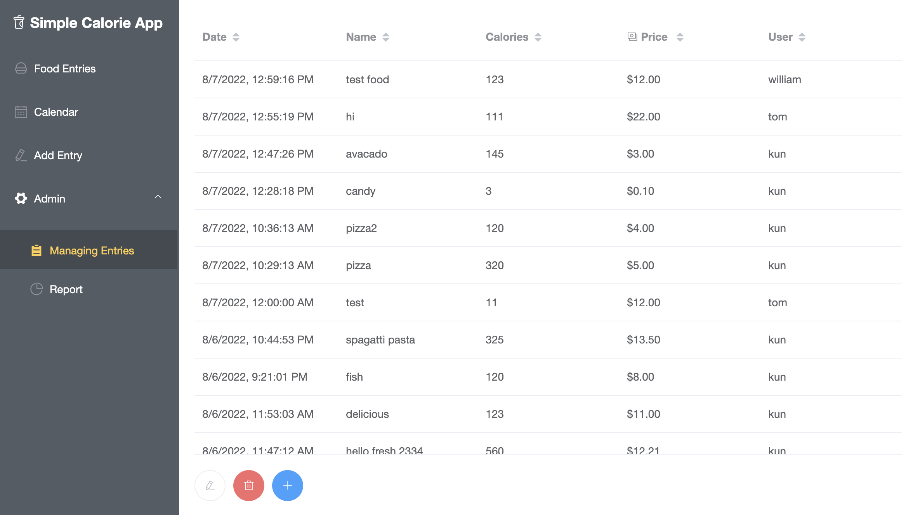
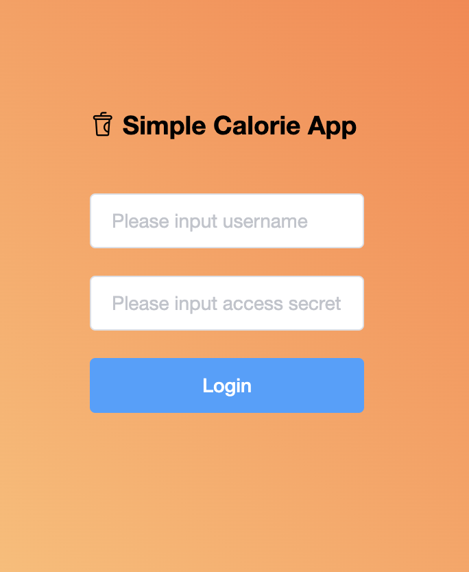

# simple-calorie-app

This is a simple calorie tracking app based on Toptal's assignment specs.





## Project setup

1. Create an `.env` file under root folder and have the follwing information:

```
DATABASE_URL = {mongoDB connection URL}
TOKEN_SECRET = {secret key used to generate JWT and auth the user}
```

2. install dependencies
```
npm install
```

3. run backend API server
```
npm run api-serve
```


### Compiles and hot-reloads for development
```
npm run serve
```

### Compiles and minifies for production
```
npm run build
```